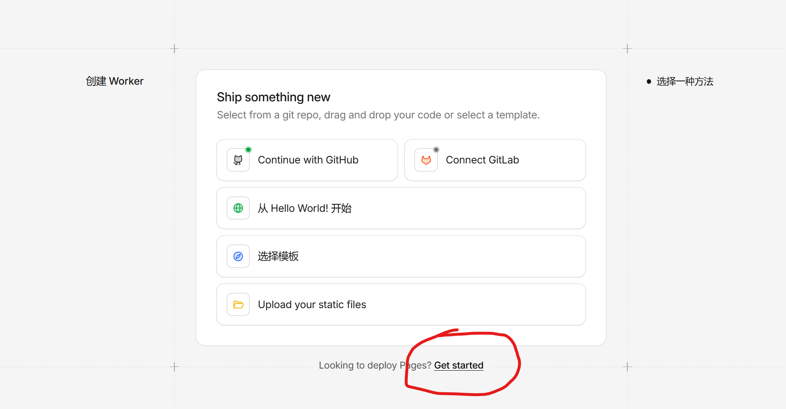
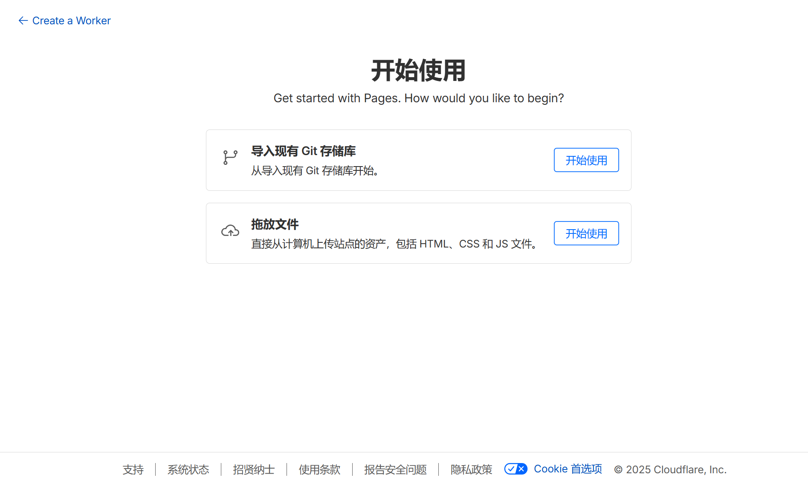

## 准备工作

首先，我们需要有几个东西  

1. 一个github账号  
2. 一个cloudfare账号  
3. 一个域名  

（因为我的域名是托管在cloudfare上面的，所以我用了cloudfare page，如果你的域名托管在腾讯云上面，推荐你使用edgeone page，这样你的DNS记录会方便一点）

## Fork项目到自己仓库

::github{repo="yuye54876/Tianyi"}  

### 克隆仓库到本地

`git clone https://github.com/you-github-name/Tianyi.git ` （记得改成你自己的用户名）   
`cd Firefly`  

#### 环境要求

Node.js ≤ 22  
pnpm ≤ 9   

## 安装依赖：

> **如果没有安装 pnpm，先安装**  
> `npm install -g pnpm`  
> **安装项目依赖**  
> `pnpm install`   

## 配置博客：

编辑 src/config/ 目录下的配置文件自定义博客设置  
你可以参考[Firefly官方文档](https://docs-firefly.cuteleaf.cn/)来进行网站设定    

## 启动开发服务器：

`pnpm dev  `  
博客将在 http://localhost:4321 可用  

**记得编辑后推送到你的github仓库里哦**

一个本地blog就已经建立好了  

## 托管到cloudfare平台

接下来首先打开你的[cloudfare仪表盘](https://dash.cloudflare.com/)  

#### 下面请按照图片步骤操作

构建>计算与AI>Workers and Pages  

然后让cloudfare与github绑定一下，选择你fork的仓库进行构建。

> 框架预设： `Astro`
> 
> 根目录：`./`
> 
> 输出目录： `dist`
> 
> 构建命令：`pnpm run build`

进行构建，等待部署成功  

#### 添加自定义域来使你的网站部署在你自己的域名上

添加Canme记录，如果你的域名托管在cloudfare上面会自动添加  

如果做完了这个，**恭喜你，现在开始享受你的blog吧**