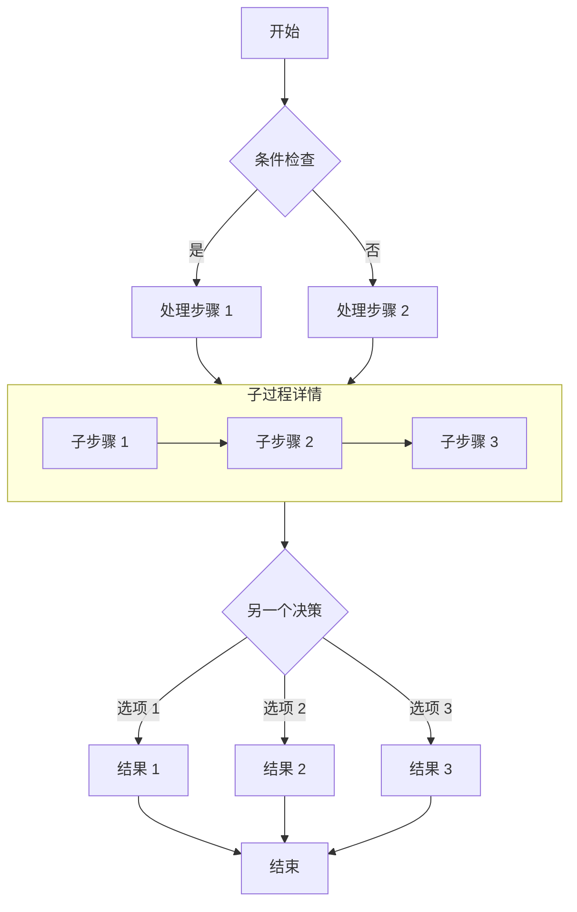

## 成功解锁了这篇文章！

如果你能看到这段内容，说明密码输入正确，文章已成功解密。

### 功能说明

- **构建时加密**：文章内容在构建时使用 AES-256-GCM 算法加密，页面源码中不包含任何明文。
- **客户端解密**：访客输入正确密码后，浏览器通过 Web Crypto API 在本地完成解密。
- **会话缓存**：同一浏览器会话内，密码会被缓存到 `sessionStorage`，刷新页面无需重复输入。
- **关闭即失效**：关闭浏览器后缓存清除，再次访问需要重新输入密码。

> 密码为 `123456`，仅供测试使用。

## 图片


## GitHub 仓库卡片

::github{repo="CuteLeaf/Firefly"}

## 提示框

> [!NOTE] NOTE
> 突出显示用户应该考虑的信息。

> [!TIP] TIP
> 可选信息，帮助用户更成功。

> [!NOTE] 自定义标题
> 这是一个带有自定义标题的示例。

## 数学公式
### 行内公式 (Inline)

欧拉公式 $e^{i\pi} + 1 = 0$ 是数学中最优美的公式之一。

质能方程 $E = mc^2$ 也是家喻户晓。

### 块级公式 (Block)

$$
\int_{-\infty}^{\infty} e^{-x^2} dx = \sqrt{\pi}
$$

$$
x = \frac{-b \pm \sqrt{b^2 - 4ac}}{2a}
$$

### 化学方程式 (Chemical Equations)

$$
\ce{CH4 + 2O2 -> CO2 + 2H2O}
$$

## 代码块
#### 常规语法高亮

```js
console.log('此代码有语法高亮!')
```

#### 渲染 ANSI 转义序列

```ansi
ANSI colors:
- Regular: Red Green Yellow Blue Magenta Cyan
- Bold:    Red Green Yellow Blue Magenta Cyan
- Dimmed:  Red Green Yellow Blue Magenta Cyan

256 colors (showing colors 160-177):
160 161 162 163 164 165
166 167 168 169 170 171
172 173 174 175 176 177

Full RGB colors:
ForestGreen - RGB(34, 139, 34)

Text formatting: Bold Dimmed Italic Underline
```


## 流程图

